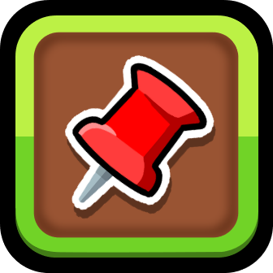

# pinned_levels
This is where she makes a mod.

a mod that allows you to pin multiple levels to the top of the created levels menu! 
the button to pin a level is found in it's edit menu.

thank you [squintted](https://x.com/squintted) for the initial idea!
and Special thanks to cvolton for the [Editor Level ID API](https://github.com/Cvolton/level-id-api-geode) Dependency! you're a real one

# Contact
If the mod bugs out for you or anything contact me either on my discord (username: deaen) or more preferably open an issue in the [github repo](https://github.com/deaen/level-pins).

